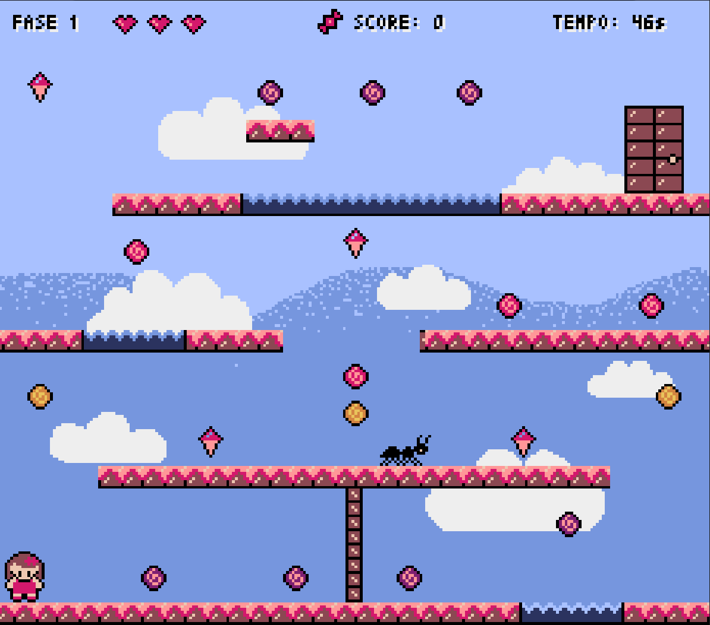
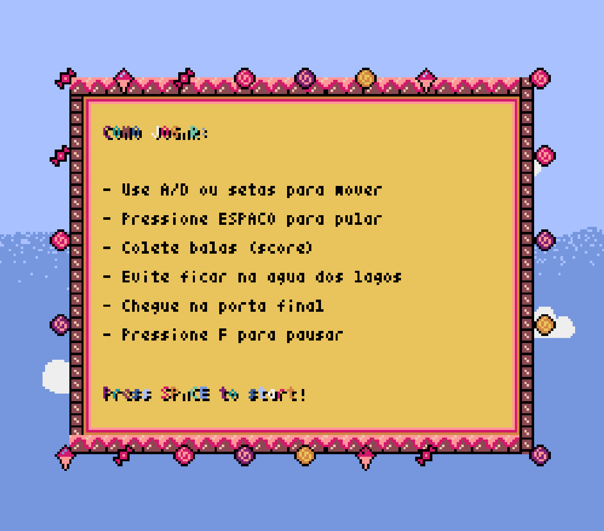
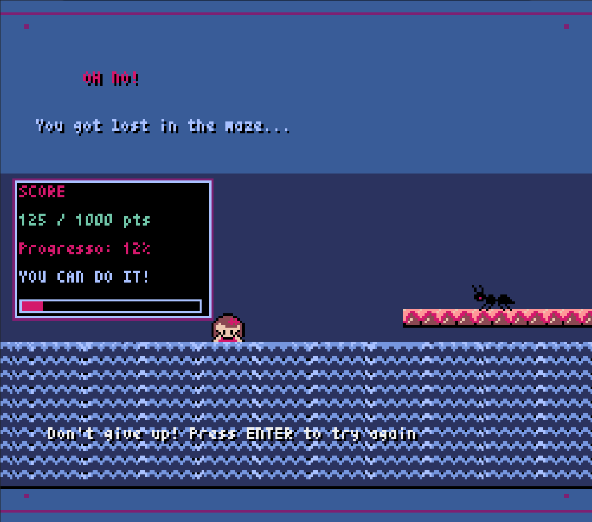
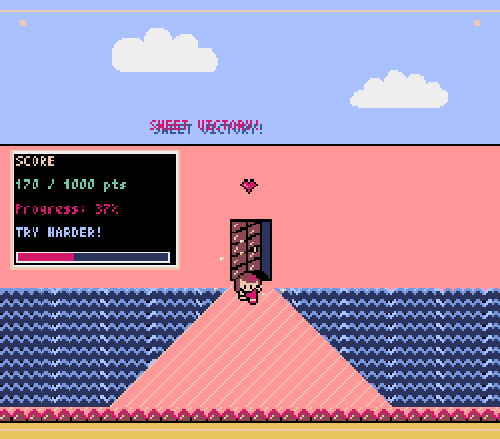

# CandyMaze 🍭

CandyMaze é um jogo simples feito em Python usando a biblioteca Pyxel. O objetivo é controlar um personagem por um labirinto doce, superando obstáculos e desafios.





## Como jogar 🍫



- **Setas Esquerda/Direita:** Movimentam o personagem para os lados
- **Espaço:** Pula 
- **Enter ou Espaço (na tela inicial):** Inicia o jogo
- **Q ou clique em (Q)UIT:** Sai do jogo
- **ESC:** Volta para o menu inicial
- **Mouse:** Clique em "START" para começar
- - **Tecla F:** Pause o jogo




## Requisitos
- Python 3.7+
- Pyxel (`pip install pyxel`)

## Como rodar
1. Instale o Pyxel:
   ```bash
   pip install pyxel
   ```
2. Execute o jogo:
   ```bash
   python CandyMaze.py
   ```

## Estrutura do projeto
- `CandyMaze.py` — Código principal do jogo
- `background.png` — Imagem de fundo
- `personagem.png` — Sprite do personagem
- `*.pyxres` — Arquivo de recursos Pyxel (tiles, tilemap, etc)

## Créditos
Desenvolvido por Mgperes e MaluMachado

---
Divirta-se no labirinto de doces!

